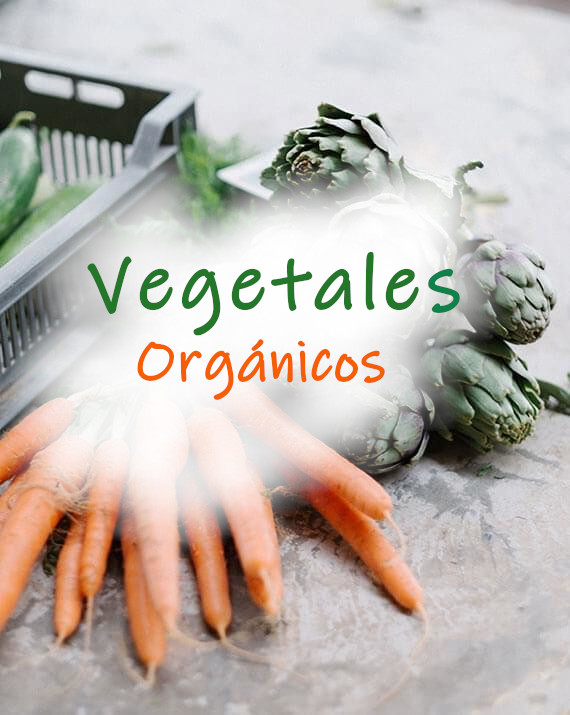
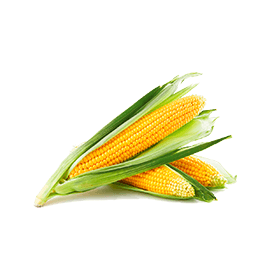

# Cultura Ecológica
## Empresa dedicada al cultivo de productos de forma natural
Landing page enfocada a una empresa de cultivos ecológicos
Me ha parecido interesante el tema de el negocio de cultivo ecológico que se de a conocer en internet.

## Herramientas usadas
Se ha usado el framework Bootstrap para hacer la página responsive y que se adapte a los dispositivos desde que se acceda.


## Paleta de colores
He escogido solo el color blabco, el color  #07521a y el color #655f05 para los fondos.
Las letras de color blanco para contrastar con el fondo #655f05, el color #cc7614 para contrastar con el fondo de color #07521a y negro en fondos blancos.

## Fuentes de letra
Las fuentes de letra las de Bootstrap y sus derivaciones.

## Estructura
- En la parte alta un Carousel con tres imágenes.
- Un título
- Una leyenda
- Tres etiquetas que se adaptan según sea tablet y movil.
- Cuatro tarjetas que sa adaptan a dos en versión tableta y las cuatro en una columna en versión movil.
- Un título de entrada a productos que se venden.
- Una imagen con título y al lado cuatro productos.
    - En versión tableta se queda una columna con la imagen arriba y los cuatro productos en dos columnas abajo.
    - En versión movil se queda todo en una columna.
- Tres desplegables con opiniones de clientes.
    - En el principal se ve imagen y titulo.
    - Se despliiega y se ve la opinión.
- Un pie de página partido con un formulario y el logo y la dirección de la empresa.
    - En versión movil el formulario y la dirección se quedan en una columna, el formulario arriba y la dirección abajo.
## Desarrollo
He tenido que modificar algunos estilos modificando el css.
```css
.colorBlanco{
    color:#FFFFFF; 
    font-size: 3em;
}

.custom-div {
    display: flex;
    flex-direction: column;
    justify-content: center;
    align-items: center;
    max-width: 370px; /* Máximo ancho */
    height: 142px; /* Altura fija */
    margin: auto; /* Centra el div en la columna */
    font-size: 1.4em;
    color: #07521a !important;
}
.custom-div {
    box-shadow: 0 0 0 1px #000, /* Este es el borde exterior */
                0 0 0 15px #fff, /* Este es el espacio entre los bordes */
                0 0 0 16px #000; /* Este es el borde interior */
}
/* Poner un marco a los botones de arriba */
.custom-div:hover {
    background-color: #07521a !important;
    color: #ffffff !important;
    box-shadow: 0 0 0 1px #e4dede, /* Este es el borde exterior */
                0 0 0 15px #07521a, /* Este es el espacio entre los bordes */
                0 0 0 16px #ffffff; /* Este es el borde interior */
}

.custom-div p:hover {
    color: #cc7614 !important;
}

.fondo-tarjetas{
    background-color: #655f05;
    margin-top: 30px;
    margin-bottom: 30px;
    padding-bottom: 10px;
}

.row > div {
    padding: 25px; /* Espaciado entre los div */
}

/* Imágenes de los galardones */
.imagen {
    width: 100px;
    height: 100px;
}
/* Acordeón */
.accordion-button:not(.collapsed){
    background-color: #FFFFFF;
}
.opinion-cliente{
    font-size: 1.5rem;
    color: #000000;
}
.p-custom-margin {
    padding-left: 4rem; /* Ajusta este valor a tus necesidades */
}

/* Premios y galardones */
/* Ajusta el tamaño de la imagen de las tarjetas para que no se hagan muy grandes al reducir la pantalla */
/* Se debe usar para una sola vez*/
.img-premio{
    text-align: center;
    max-width: 270px;
    max-height: 145px;
}
/* rectifco el alto de la tarjeta para que sea un mínimo de altura y quden todas iguales */
.card{
    min-height: 440px;
}
/* Modificar los colores de el botón del formulario */
.btn{
    background-color: #655f05;
    border: 1px solid #fff;
}
.btn:hover{
    background-color: #3d3903;
    border: 1px solid #fff;
}
/* Pie de página */
.pie{
    background-color: #655f05;
    color: #ffffff;
    padding: 20px; /* Añade un poco de espacio interno */
}
.alto-minimo{
    /* Se crea una altura mínima al 100% para que siempre tengan el mismo tamaño */
    min-height: 100%;
}
/* Poner los textos en negrita */
.negrita{
    font-weight: bold;
}
```
He hecho pruebas en ordenador, tablet y movil con buenos resultados.

## Retos
Ha habido algunos problemas de posicionamiento al cambiar de tamaño de pantalla cuando se muestra el producto al estar anidadas dos etiquetas `row`. Para que las imágenes se colocasen bien he tenido que usar el estilo ``class="img-fluid"``
El código `HTML` con sus clases es:

```css
<div class="row">
      <div class="col-lg-6 col-md-12 col-sm-12 text-center mb-3">
          
      </div>
      <div class="col-lg-6 col-md-12 col-sm-12">
          <div class="row">
              <div class="col-lg-6 col-md-6 col-sm-12 text-center mb-3">
                  
                  <p class="text-center negrita">Aguacate</p>
                  <p class="text-center">Precio 2€</p>
                  
                  <p class="text-center negrita">Maíz</p>
                  <p class="text-center">Precio 2€</p>
              </div>
              <div class="col-lg-6 col-md-6 col-sm-12 text-center mb-3">
                  
                  <p class="text-center negrita">Brócoli</p>
                  <p class="text-center">Precio 2€</p>
                  
                  <p class="text-center negrita">Alcachofa</p>
                  <p class="text-center">Precio 2€</p>
              </div>
          </div>
      </div>
```
## Aprendizaje
Nunca había usado Bootstrap pero lo veo que con un poco de práctica se puede usar para implementar de forma rápida estilos a pequeños proyectos.

